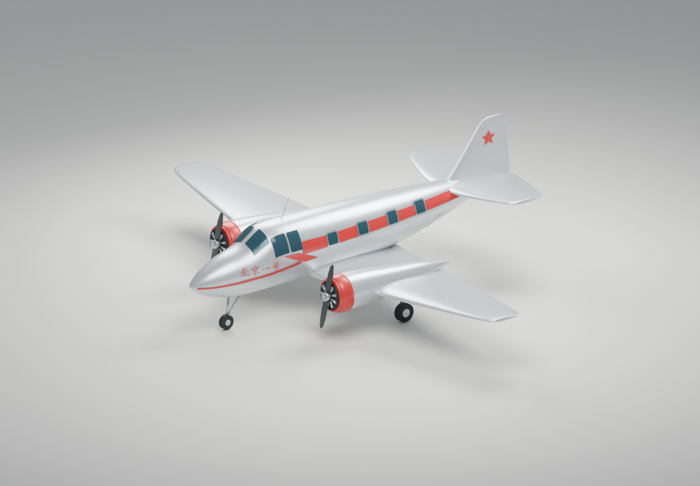

# 北京一号 · 航空记忆

北航 1958 年“北京一号”轻型旅客机的非官方外观复原。交付包括 Blender 源工程、网页 GLB、离线网页和 1:72 分件打印套件。采用机长 12.4 m、翼展 16.3 m 基准；局部形状依据照片近似，不是原始工程模型。

## 在线展示

**[打开北京一号交互展示](https://mrroam.github.io/beijing-one/)**

支持旋转、缩放、视角切换、螺旋桨启停和模型下载。网站通过 GitHub Pages 发布，仓库 `main` 分支根目录为发布源。



## 本地查看模型

在本文件所在目录运行 `python serve.py`，浏览器打开 **http://127.0.0.1:8765/web/**。Windows 本机也可双击 `打开预览.cmd`。预览服务只监听本机，关闭终端或按 Ctrl+C 停止。若 8765 已被占用，可运行 `python serve.py --port 8766`，相应改用 8766 地址。

网页依赖已经随包附带，不需要 npm 或联网。请通过上述本地服务打开，直接双击 HTML 会受到浏览器模块加载限制。支持拖动旋转、缩放、四个视角、螺旋桨启停和起落架显示切换。在线版本使用相同的静态资源。

使用 Blender 5.0.1 打开 `models/beijing-one.blend` 可编辑展示版；`print/beijing-one-print.blend` 是毫米制装配工程。后者中的零件处于装配坐标，实际打印请导入已摆正的 STL 或 layout 3MF。

## 文件索引

| 文件 | 用途 |
| --- | --- |
| `models/beijing-one.blend` | 完整外观源工程，含材质、灯光、相机及螺旋桨对象 |
| `models/beijing-one.glb` | 网站展示；约 1.15 MB，42,218 个三角面 |
| `models/beijing-one-blockout.blend` | 主体比例草模 |
| `web/` | 完整静态网页及本地 Three.js 依赖 |
| `print/` | 11 种 STL、通用 3MF、打印源工程及检查数据 |
| `beijing-one-print-kit.zip` | 单独的打印套件压缩包 |
| `previews/` | 外观四视图、比例轮廓、打印装配图、几何截面和网页截图 |
| `docs/打印与装配说明.md` | 编号、方向、间隙与装配步骤 |
| `docs/资料与尺寸依据.md` | 公开来源、尺寸冲突与近似部分 |
| `docs/验证记录.md` | 已验证内容及尚未完成的实物验证 |
| `source/` | 可复现的 Blender 生成脚本与独立文件检查脚本 |

## 打印状态

机长约 **172.2 mm**、翼展约 **226.4 mm**。打印版采用无起落架的静态展示姿态，薄边和桨叶已加厚，配有底座、定位销和孔径试片。几何文件检查通过。

打印机、材料和喷嘴尚未确定。通用 3MF 只含几何和参考摆放，不含机型配置、支撑或 G-code；未做机器切片或实物试打。先打印 09 号销与 11 号试片，再决定最终孔径补偿。详情见装配说明。

## 修改与复现

已使用 Blender 5.0.1 和 Python 3.13.11 验证。以下示例需将 Blender 加入 PATH，或把 `blender` 替换成其完整安装路径。建模脚本必须由 Blender 内置 Python 执行，按以下顺序运行会重建对应输出，手工修改前请另存副本：

```powershell
blender --background --factory-startup --python-exit-code 1 --python source/build_model.py
blender --background --factory-startup --python-exit-code 1 --python source/build_print.py
blender --background --factory-startup --python-exit-code 1 --python source/make_presentations.py
python source/verify_assets.py
```

外形站位定义在 `source/build_model.py`，尺寸依据记录在 `source/dimensions.json`；后者是依据表，修改它不会自动重塑全部站位。打印比例、插销和间隙定义在 `source/build_print.py`。网页通过 `Propeller_L`、`Propeller_R` 节点控制螺旋桨，通过 `Gear_` 前缀控制起落架。

网站配图均由本项目模型渲染，未将参考摄影作品、文献 PDF 或系统字体文件打包。第三方 Three.js 的 MIT 许可保留在 `web/vendor/THREE-LICENSE.txt`。本项目不代表北航官方出品。

## 发布到 GitHub Pages

此仓库使用 `main` 分支的根目录发布，`.nojekyll` 保留原始静态资源和 Markdown 下载文件。根页面转到 `web/`，模型与依赖均使用相对路径，支持项目站点前缀。更新后提交并推送到 `main`，GitHub 自动重新发布。

公开仓库只包含本项目的展示、生成代码与交付文件；参考文献原件、制作日志和工作缓存保留在本地。Three.js 使用随包附带的 MIT 许可。
